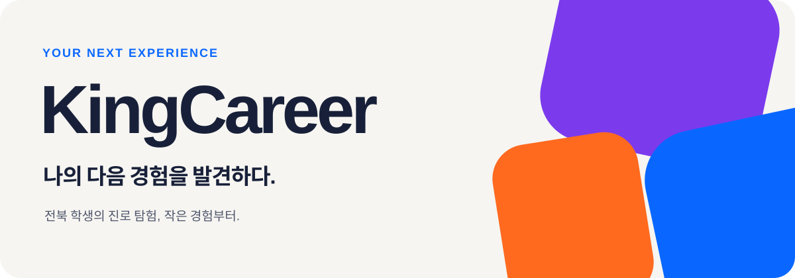

<p align="center">
  
</p>

<p align="center">
  
</p>

<p align="center"><strong>진로는 경험하고 선택해야 한다.</strong></p>
<p align="center">전북 중·고등학생을 위한 진로경험 플랫폼</p>

## KingCareer

학생이 알고 있는 직업과 실제로 경험한 일 사이에는 빈칸이 있습니다. KingCareer는 탐색, 직무 상황 선택, 작은 프로젝트, 회고를 기록하고 학생에게 필요한 다음 경험을 제안합니다. 특정 직업을 계속 좋아하게 만드는 것보다 스스로 선택할 근거를 만드는 것이 목표입니다.

현재는 로컬 개발용 웹 화면과 FastAPI·SQLite 백엔드를 구현했습니다. 다섯 직업 모두 **3D 현장 조사 → 조치·인계 → 수료 카드 → 개선 설계 포트폴리오**로 이어집니다. 키 없이 준비된 시나리오로 실행하며, Gemini를 설정하면 질문 안내와 별도로 요청한 프로젝트 텍스트 피드백을 받을 수 있습니다.

[스마트팜 바로 열기](http://127.0.0.1:5173/app/#simulation?career=farmer) · [설계 작업실](http://127.0.0.1:5173/app/#projects?career=farmer) · [로컬 개발 범위·Gemini 설정·사용자 확인 항목](docs/local-fieldwork.md)

## 구현한 기능

| 영역 | 현재 동작 |
| --- | --- |
| 서비스 소개 | 원본 6면 3D 큐브·회전·스크롤·직업 트랙을 보존하고, 지역 목록을 다섯 직무 현장 목록으로 변경 |
| 학생 계정 | 아이디·비밀번호·닉네임 가입, 로그인, 프로필·관심분야 수정, 비밀번호 변경, 로그아웃·계정 삭제 |
| 관심·경험 진단 | 6개 질문의 자기보고 응답을 서버에 기록 |
| 경험지도·추천 | NetworkX 그래프에서 교육용 경험목표와 기록 근거를 연결해 공백과 추천 이유 제시 |
| 직무체험 | 5개 직업의 객관식 판단·조치·인계·회고, 선택적 코치 질문, 관심도와 재접속 후 이어하기 |
| 미니 프로젝트 | 3단계 결과물, 서버 초안 자동 저장, 수정 이력, 중복 제출 방지 |
| 다섯 직무 현장 체험 | 운영실·병동·온실·차량 시험실·식품 연구실의 3D 조사, 객관식 조치, 결과 변화·인계, 서버 상태 복원 |
| 3D 표현 | CC0 차량·가구 에셋, 둥근 모서리와 표면 반사, 환경 조명·그림자, 대상 접근 카메라·화질 선택. [상세](docs/scene-quality.md) |
| 수료·배지 | 크랩 원본과 직업 그림을 사용한 수료 카드, 활동 근거별 배지, SVG 다운로드 |
| 직무별 설계 작업실 | Excalidraw 직무 도안·설명 자동 저장, 수정본 복원, 결과물·PNG·SVG·JSON 내보내기 |
| 탐색·포트폴리오 | 직업·전공 탐색, 관심 직업 저장, 활동·결과물 확인, 텍스트 다운로드 |

교사·멘토 기능은 포함하지 않습니다. 메일·소셜 로그인과 계정 찾기, 푸시·메일 알림 발송, 실시간 기업 제휴 정보는 제공하지 않습니다. 알림 설정은 환경설정만 저장합니다.

앱은 주황 `#FF6A1F`, 보라 `#7C3AED`, 파랑 `#0967FF`와 단색 배경을 사용합니다. 제공된 캐릭터·직업 이미지·배경을 적용하고, 카드와 페이지 전환에 움직임을 더했습니다. 시스템의 움직임 줄이기 설정을 지원합니다.

## Windows에서 실행

Python 3.11 이상, Node.js 22.12 이상을 준비합니다. 아래 명령은 저장소 루트의 PowerShell에서 실행합니다.

첫 번째 터미널에서 백엔드를 준비하고 실행합니다. `.env`는 기존 파일이 없을 때만 복사합니다.

```powershell
python -m venv .venv
.\.venv\Scripts\python.exe -m pip install -r backend/requirements.txt
if (-not (Test-Path -LiteralPath 'backend/.env')) {
    Copy-Item -LiteralPath 'backend/.env.example' -Destination 'backend/.env'
}
.\.venv\Scripts\python.exe -m backend.scripts.init_db
.\.venv\Scripts\python.exe -m uvicorn backend.main:app --host 127.0.0.1 --port 8000
```

두 번째 터미널에서 프론트엔드를 실행합니다.

```powershell
npm.cmd install
npm.cmd run dev
```

| 주소 | 용도 |
| --- | --- |
| [127.0.0.1:5173](http://127.0.0.1:5173/) | 서비스 소개 |
| [127.0.0.1:5173/app/](http://127.0.0.1:5173/app/) | 학생 앱 |
| [127.0.0.1:8000/docs](http://127.0.0.1:8000/docs) | 실제 API 입력·응답 문서 |

Vite가 `/api` 요청을 FastAPI로 전달합니다. 브라우저 주소는 `127.0.0.1`로 통일합니다. SQLite와 시뮬레이션 체크포인트는 **한 worker**로 실행하도록 구성되어 있습니다. Uvicorn의 `--workers`를 늘리지 않습니다.

`npm.cmd run build`로 타입 검사와 화면 빌드를 수행할 수 있습니다. 빌드 후 FastAPI만 실행하면 `http://127.0.0.1:8000/`에서 소개 페이지, `/app/`에서 학생 화면을 함께 확인할 수도 있습니다. 이번 작업은 로컬 개발 범위입니다.

## 경험 기록과 AI

경험지도 숫자는 **교육용 목표 중 기록이 있는 비율**입니다. 같은 활동을 반복 클릭해 점수를 계속 올릴 수 없으며, 기록이 없으면 확인 근거가 없는 상태로 표시합니다. 직무 능력·적성을 평가하는 검사 점수가 아닙니다. 자기보고, 활동 참여, 제출물을 구분하고 관심도는 별도로 기록합니다. 현직자 교류와 학과 이해를 확인하는 별도 검증 경로는 아직 구현하지 않았습니다.

`KingCareer Experience Graph / Gap Engine`은 [별도 Python 패키지](backend/experience_graph/README.md)로 구성했습니다. xAPI 형식의 행동 기록과 ESCO·O*NET 출처를 교육용 목표에 연결하고 NetworkX로 공백을 계산합니다. LangGraph는 분기형 체험의 상태와 체크포인트를 관리합니다.

기본 설정은 `KINGCAREER_AI_MODE=template`입니다. Gemini API 연결과 별도 요청하는 프로젝트 텍스트 피드백을 구현했으며 **실제 키를 사용한 호출은 수행하지 않았습니다**. Qwen3·vLLM·BGE-M3, PostgreSQL·pgvector는 실행 의존성에서 제외했습니다. 설정과 제한은 [로컬 개발 안내](docs/local-fieldwork.md)에 있습니다.

## 저장 데이터

학생 기록은 `backend/storage/kingcareer.db`, 시뮬레이션 체크포인트는 `backend/storage/checkpoints.db`에 저장합니다. 비밀번호는 Argon2로 해시하고 로그인은 서버 세션과 HttpOnly 쿠키를 사용합니다. 기존 `itda-career-v1` 브라우저 저장값은 가져오거나 삭제하지 않습니다.

`.env`, 모델 키, SQLite 파일, Python 가상환경과 사용자 저장 디렉터리는 Git에서 제외합니다. 백업은 서버를 종료한 뒤 저장 디렉터리 전체를 복사합니다. 별도 데이터베이스 서버나 GPU는 필요하지 않습니다.

## 문서와 확인

| 문서 | 내용 |
| --- | --- |
| [학생 화면 IA](docs/front-ia.md) | 페이지 경로, 로그인 범위, 화면 사이의 연결 |
| [학생 앱 디자인 개편](docs/design-refresh.md) | 홈·크랩 카드·체험·프로젝트·수료 카드의 변경과 사용자 확인 항목 |
| [AI 경험 회고와 다음 선택](docs/career-review.md) | 객관식 회고, 근거를 포함한 정리, 학생 확인·수정, 직업 지도 연결 |
| [API 계약](docs/api.md) | 인증, 요청·응답 타입, 버전·재시도·오류 처리 |
| [OSS와 데이터 출처](docs/data-sources.md) | 사용 기술, 수집한 직업 데이터, 버전과 이용 조건 |
| [소개 페이지 원본](docs/landing-source.md) | HTML·3D·지원 런타임·제공 이미지의 보존 범위 |
| [사용자 확인 목록](docs/manual-review.md) | 실행 후 확인할 흐름과 기존 테스트 수정 사항 |

최근 리뷰의 수정 내용과 확인 결과는 [흐름·저장 개선 기록](docs/review-improvements.md)에 정리했습니다. 기존 체험판 테스트는 현재 학생용 경로로 교체했습니다.

메뉴·홈 간소화, 모바일 체험 순서, 단계 카드 작성, 최초 방문 도움말은 [학생 사용 흐름 개선](docs/student-usability.md)에 정리했습니다.

`npm.cmd run test:ui`는 브라우저 테스트 응답으로 화면을 확인합니다. `npm.cmd run test:api`는 로컬 FastAPI에 임시 계정을 만들고 검사 후 삭제하여 실제 저장·복원을 확인합니다. 두 검사는 모델 생성 응답을 대체하므로 Gemini를 호출하지 않습니다. 전체 브라우저 검사는 `npm.cmd run test:e2e`입니다.

백엔드는 `.\.venv\Scripts\python.exe tests/backend_review_test.py`와 `.\.venv\Scripts\python.exe tests/test_simulation_review.py`로 확인합니다. 사용자 DB와 분리된 임시 SQLite와 모의 AI를 사용합니다. 기존 데이터는 서버 재시작 시 적용되는 `005_project_progress.sql` 마이그레이션으로 관심도 저장 필드를 추가합니다.
