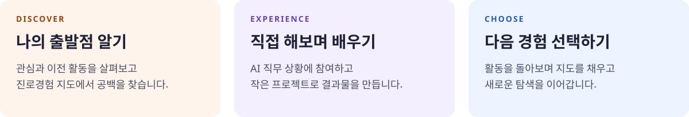

  

<strong>진로는 추천받는 것이 아니라, 경험하고 선택해야 한다.</strong>

전북 중·고등학생을 위한 개인별 AI 진로 경험 서비스

## 서비스 소개

전북 학생의 활동·경험 데이터를 바탕으로 개인별 **진로 경험 공백**을 발견하고, 생성형 AI가 필요한 직무 시뮬레이션과 미니 프로젝트를 만드는 웹 플랫폼입니다.

학생이 아직 경험하지 못한 일을 직접 탐색하며, 자신의 진로를 선택할 근거를 쌓도록 돕습니다.

현재는 서비스 기획 단계이며, 아래 내용은 구현할 기능과 MVP 범위를 정리한 초안입니다. 서비스명은 추후 확정합니다.

## 배경과 문제

전북 읍·면 지역 학생은 주변에서 접할 수 있는 직업과 현직자의 범위가 제한적일 수 있습니다. 직업정보를 알고 있더라도 실제로 어떤 일을 하는지, 어떤 판단과 역량이 필요한지 경험할 기회는 부족할 수 있습니다.

이 프로젝트는 학생마다 **알고 있는 직업의 범위와 경험의 깊이가 다른 상태**를 ‘진로 경험 격차’로 정의합니다.

같은 개발자 체험이라도 학생마다 필요한 출발점은 다릅니다.

| 학생의 현재 상태 | 필요한 경험 |
| --- | --- |
| 개발자라는 직업을 처음 접함 | 직업의 역할과 일상 탐색 |
| 개발자에 관심은 있지만 개발 과정은 모름 | 직무 상황 체험과 작은 프로젝트 |
| 개발 경험은 있지만 관련 전공은 모름 | 학과·학습경로 탐색 |

이 차이를 파악하고, 학생에게 필요한 다음 경험을 제공하는 것이 서비스의 출발점입니다.

## 해결 방향

  

처음부터 희망 직업을 정하도록 요구하지 않습니다. 관심 콘텐츠 선택, 직무 상황 질문, 프로젝트 수행, 활동 후 소감 등 탐색 과정에서 얻은 데이터를 바탕으로 **진로경험 지도**를 만듭니다.

지도는 직업군별로 다음 영역을 살펴봅니다.

- 직업 존재 인식
- 직무 이해
- 프로젝트·직무 활동 경험
- 필요 역량 이해
- 관련 학과 이해
- 현직자와의 교류 경험

AI는 이 지도에서 경험 공백을 찾아 학생의 관심, 이해 수준, 이전 활동에 맞는 다음 활동을 생성합니다. 지도에는 판단의 근거가 된 활동을 함께 기록하며, 활동 기록이 없다는 이유만으로 경험이 없다고 단정하지 않습니다.

## 핵심 기능

| 기능 | 내용 |
| --- | --- |
| 관심·경험 진단 | 학생이 무엇에 관심이 있고 무엇을 알고 경험했는지 탐색 |
| 진로경험 지도 | 직업군별 탐색 현황과 부족한 경험을 시각화 |
| AI 직무 시뮬레이션 | 학생의 선택에 따라 다음 상황이 달라지는 직무 체험 생성 |
| AI 미니 프로젝트 | 실제 결과물을 만드는 작은 과제와 단계별 안내 제공 |
| 활동 후 피드백·재진단 | 학생의 선택, 결과물, 회고를 바탕으로 지도 업데이트 |
| 다음 경험 제안 | 남아 있는 경험 공백과 새롭게 생긴 관심을 반영해 후속 활동 생성 |

### AI가 만드는 경험 예시

**앱 개발자 직무 시뮬레이션**

> 전북의 한 스타트업에서 앱 개발자로 일하고 있습니다. 사용자들이 회원가입 화면에서 계속 이탈합니다. 무엇부터 확인하시겠습니까?

학생이 “사용자에게 이유를 물어본다”를 선택하면, AI가 가상의 인터뷰 결과를 제시하고 개선안을 고민하는 다음 상황으로 이어갑니다.

**미니 프로젝트 예시**

- 개발자: 학교 급식 메뉴를 알려주는 웹페이지 기획하기
- 스마트팜 전문가: 작물 재배 환경 데이터를 보고 관리 계획 세우기
- 식품 연구원: 지역 농산물을 활용한 간식 아이디어와 비교 실험 계획 만들기

AI 체험은 가상 활동으로 구분해 기록합니다. 현장 방문이나 현직자 교류 경험은 별도 영역으로 관리합니다.

## 사용자 흐름

| 단계 | 학생의 활동 |
| --- | --- |
| 시작 | 가입 후 관심과 이전 경험을 입력합니다. |
| 발견 | 진로경험 지도에서 탐색 현황과 부족한 경험을 확인합니다. |
| 경험 | AI 직무 시뮬레이션에 참여하고 미니 프로젝트를 수행합니다. |
| 회고 | 결과물을 제출하고 경험하면서 느낀 점을 기록합니다. |
| 확장 | 피드백과 갱신된 지도를 확인하고 다음 경험을 선택합니다. |

활동 후 관심도가 낮아지는 것도 의미 있는 결과입니다. 특정 직업을 계속 좋아하게 만드는 것보다, 경험을 통해 자신의 선택 이유를 구체화하는 것을 목표로 합니다.

## 전북과의 연결

학생이 사는 지역의 산업과 생활 문제를 직무 체험의 소재로 활용합니다. 아래는 콘텐츠 기획 예시이며, 실제 콘텐츠 제작 시 지역 자료를 확인해 구체화할 예정입니다.

| 지역 | 체험 소재 예시 |
| --- | --- |
| 전주 | 콘텐츠·관광·IT |
| 군산 | 자동차·이차전지·항만 |
| 익산 | 식품·바이오 |
| 김제 | 스마트농업·특장차 |
| 완주 | 자동차·수소 |
| 새만금 | 이차전지·에너지 |

장기적으로는 지역 기업·대학·현직자와 연계해 온라인 탐색이 실제 지역 경험으로 이어지도록 확장할 계획입니다.

## MVP 범위

**대상:** 전북 중·고등학생 
**형태:** 웹 서비스 
**초기 직업군:** 개발자, 간호사, 스마트팜 전문가, 자동차 엔지니어, 식품 연구원

| 구현 예정 기능 | MVP에서 제공할 범위 |
| --- | --- |
| 관심·경험 진단 | 초기 관심과 경험 기록 수집 |
| 개인별 진로경험 지도 | 직업군별 경험 현황 표시 |
| AI 직무 시뮬레이션 | 선택에 따라 분기하는 직무 상황 |
| AI 미니 프로젝트 | 작은 과제 수행과 결과물 제출 |
| 활동 결과 분석 | 활동 근거에 따른 피드백 |
| 다음 경험 생성 | 경험지도 갱신과 후속 활동 제안 |

## 성과 확인 방향

추천한 직업을 학생이 얼마나 좋아하는지보다 **경험을 통해 무엇이 달라졌는지**를 확인합니다. 구체적인 측정 기준과 산식은 MVP 설계 과정에서 정합니다.

| 지표 | 확인할 변화 |
| --- | --- |
| 직무 이해도 변화 | 실제 업무와 필요한 판단을 더 구체적으로 설명하는가 |
| 경험 공백 감소율 | 부족했던 영역에 새로운 활동 근거가 쌓였는가 |
| 진로확신도 변화 | 관심의 유지·변화 이유와 선택 근거가 구체화됐는가 |
| 신규 직업 발견 수 | 이전에 몰랐던 직업을 새롭게 탐색했는가 |
| AI 체험 완료율 | 시작한 체험을 끝까지 수행했는가 |
| 재사용률 | 이후 다시 방문해 다른 경험을 탐색하는가 |

## 추후 구체화할 내용

- 경험지도 평가 기준과 진단 근거 표시 방식
- 학생 데이터 수집 범위, 동의 및 보관·삭제 정책
- 생성 콘텐츠의 사실성·연령 적합성 검토 방식
- 기술 스택, 시스템 구조 및 로컬 실행 방법
