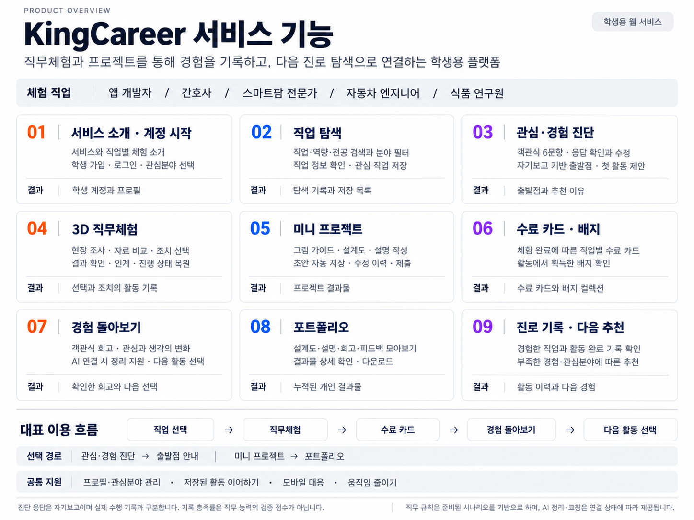

# KingCareer 서비스 기능 개요

제안서·노션 문서용 기능 안내 이미지입니다. 주요 기능 9개를 기능 설명과 결과물로 구분하고, 대표 이용 흐름 및 선택 경로를 표시했습니다.

[PNG 원본](images/kingcareer-features-professional-v2.png) · [생성 프롬프트](images/kingcareer-features-professional-v2.prompt.txt)

내장 image_gen으로 제작했습니다. 기존 캐릭터 중심 이미지와 별도로 보관합니다.
