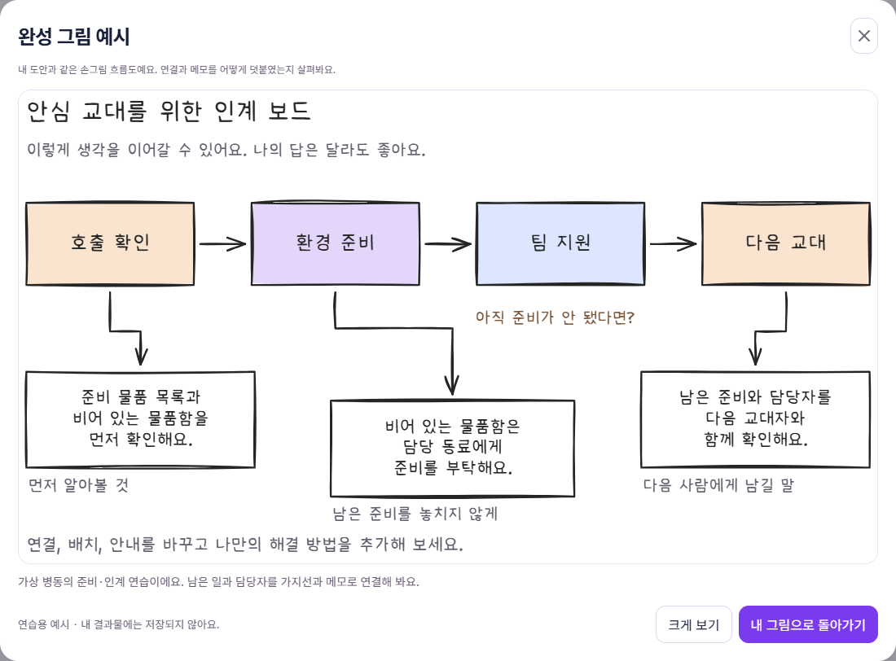

# KingCareer 기능 QA — 2026-09-13

모바일 개편 이후 로컬 프론트엔드와 백엔드의 기능을 함께 점검했다. 기존 학생 데이터 대신 임시 계정과 격리된 테스트 저장소를 사용했다. 현재 변경사항의 배포는 수행하지 않았다.

## 검사 범위

| 영역 | 확인한 내용 |
| --- | --- |
| 계정 | 가입, 중복 아이디, 로그인·로그아웃, 비밀번호 변경, 이전 세션 무효화, 계정 삭제 |
| 데이터 분리 | 다른 학생의 기록·시뮬레이션 접근 차단, 프로필 유지, 기록 삭제 |
| 진단 | 응답 저장, 동일 요청 재전송, 경험지도와 추천 반환 |
| 직무체험 | 자료 조사, 조치, 결과, 회고, 수료증·다운로드, 재시도와 초점 복원 |
| 미니 프로젝트 | 손그림 편집, 초안 저장·복원, 수정 이력, 제출 조건, 중복 제출, 작업 백업 |
| 포트폴리오 | 정확한 활동 선택, 그림·설명 표시, AI 평가 재시도·저장, 문서 내보내기 |
| 도움말 | 오버레이, 키보드 초점, 다시 보지 않기, 설정에서 다시 열기 |
| 반응형 | 모바일·태블릿·PC 폭, 화면 넘침, 작업실 패널 전환, 공통 메뉴 |
| 배포 저장소 | 별도 임시 PostgreSQL 스키마의 마이그레이션·RLS·재시작·동시 실행 잠금 |

## 실제 API 검사

로컬 HTTP 계정·프로필·진단·내보내기 검사 30개가 통과했다. HttpOnly 쿠키, 외부 Origin 거부, 비밀번호 변경 뒤 이전 세션 차단도 확인했다. 검사 계정 두 개는 삭제했다.

Gemini `gemini-3.5-flash-lite` 실제 호출은 프로젝트 도움말 약 2.00초, 포트폴리오 평가 약 2.06초, 경험 재정리 약 2.53초로 모두 성공했다. 그림과 답변 보존 및 계정 삭제까지 확인했다. 이는 해당 시점의 실호출 결과이며 무료 티어의 지속적인 가용성을 보장하지 않는다.

PostgreSQL 검사는 임의의 `qa_*_test` 스키마에서 4개 모두 통과했다. 검사 후 해당 임시 스키마만 제거했다.

## 자동 검사와 실제 호출 구분

브라우저 전체 재실행은 38/40 통과였다. 두 실패는 미리보기의 이전 `img` 태그와 제출 응답의 이전 `not_connected` 값을 기대하던 검사였다. 해당 검사 코드를 수정하고 관련 파일 7개 시나리오를 재실행해 7/7 통과했다. 따라서 현재 코드에 대한 전체 40개 시나리오는 전체 실행과 관련 재실행을 합쳐 확인한 결과이며, 한 번의 실행에서 40/40 통과했다고 기록하지 않는다.

| 최종 확인 | 결과 |
| --- | --- |
| 브라우저 전체 실행 | 38/40, 변경된 계약을 기대하지 않던 2개 실패 |
| 해당 파일 재실행 | 7/7 통과, 위 2개 포함 |
| Python SQLite | 35/35 통과 |
| PostgreSQL 격리 스키마 | 4/4 통과, 스키마 제거 |
| 로컬 계정·프로필·진단·내보내기 | 30개 체크 통과, 계정 제거 |
| Gemini 실제 호출 | 도움말·평가·재정리 3개 성공 |
| 새 제출 상태 실서버 확인 | 제출·복원·계정 삭제 확인 |
| TypeScript·Vite 빌드 | 성공, 기존 500kB 초과 번들 경고 유지 |

수정 후 Python 검사 35개가 통과했다: 계정·기록·평가 13개, 프로젝트 제출 조건 3개, 상호작용 프로젝트 11개, 시뮬레이션 회고 8개. 실제 로컬 서버에서도 새 제출 응답과 재조회 값이 `not_requested`인 것을 추가 확인하고 검사 계정을 삭제했다.

첫 전체 브라우저 실행은 40개 중 39개가 통과했다. 실패 추적의 접근성 스냅샷에는 그림 예시 팝업과 ‘예시 그림을 준비하는 중’ 문구가 남아 있었다. 팝업이 사라진 것이 아니라 SVG의 폰트 포함 처리가 지연된 경우였다. 폰트 파일 요청도 다수 확인됐다.

예시 그림은 프로젝트에 포함된 손그림 템플릿을 그대로 문서 내 SVG로 표시하도록 바꿨다. 편집기에서 쓰는 폰트를 재사용하며, 미리보기를 위해 폰트를 파일에 포함하는 작업을 반복하지 않는다. 실제 다운로드·포트폴리오 SVG의 기본 폰트 포함 동작은 유지했다. 테스트는 그림의 표시, SVG 크기·텍스트 존재, 다섯 직업·확대·닫기·모바일 표시를 확인한다.

실제 AI 호출은 성공했지만 제출 응답이 `not_connected`로 저장되는 별도 표시 오류도 발견했다. AI 모드의 새 제출물은 `not_requested`로 저장하고 ‘AI 피드백 요청 전’으로 표시한다. 명시적으로 평가를 요청해 성공한 결과만 `ai_feedback`이 된다. 연결이 설정되었다는 이유로 평가가 끝났다고 표시하지 않으며 기존 학생 기록을 일괄 변경하지 않았다. 일반 손그림과 이전 상호작용 프로젝트에 각각 회귀 검사를 추가했다.

Playwright UI 검사는 대체 API 응답을 사용하는 화면 검사와 임시 로컬 계정으로 저장하는 검사로 구성된다. 브라우저 테스트의 AI 응답은 대체 응답이며 위의 실제 Gemini 호출과 별도다. Python 기능 검사는 격리된 SQLite와 대체 AI를 사용한다.

## 확인 한계

Chrome의 모바일 화면 크기와 터치 환경을 검사했다. 실제 iPhone/Safari, Android 기기의 가상 키보드, 스크린리더 사용성, 장시간 부하·무료 API 할당량 소진 시험은 포함하지 않았다. 현재 작업본을 운영 배포한 것은 아니다.

검사 원본 로그는 `.local/full-qa-*`에 보관한다. 비밀번호·모델 키·DB 연결 문자열을 문서에 포함하지 않는다.

## 화면 근거



[모바일 확대 화면](qa/2026-09-13-functional/drawing-example-mobile.png)에서도 손그림 글꼴과 닫기·확대 전환 버튼을 확인했다.

## 추가 수정: 회고 화면의 빈 공간

사용자 화면에서 현장 패널이 접힌 뒤에도 결정 단계의 2열·2행 배치가 남아, 두 행에 걸친 회고 카드 높이가 왼쪽 빈 행을 늘리는 문제가 확인됐다. 처음 적용한 한 열 배치는 사용자 요청에 따라 되돌렸다. 최종 수정은 기존 2열과 열 너비를 유지하면서 행 높이를 `auto 1fr`로 지정해 크랩 안내가 접힌 현장 바로 아래에 오도록 한다. 모바일은 기존 한 열을 유지하고 수료 버튼이 문항을 가리지 않도록 일반 흐름에 둔다.

이전 검사는 화면 넘침과 조작 가능 여부를 확인했지만 이 빈 공간을 검출하지 못했다. 현장과 안내 사이의 간격이 20px 이내인지, PC에서 기존 2열이 유지되는지, 모바일은 한 열인지, 수료 버튼이 문항 아래에 있는지 검사에 추가했다.

[수정한 PC 회고](qa/2026-09-13-functional/reflection-desktop.png) · [수정한 모바일 회고](qa/2026-09-13-functional/reflection-mobile.png)

## 추가 수정: 프로젝트 코치

작업 중 도움말이 현재 과제 대신 `careers.json`의 과거 급식 알리미 과제를 전달하던 문제를 수정했다. 이제 화면과 동일한 `workplaces.json`의 과제 제목·의뢰·힌트를 사용한다. 평가에도 현재 과제와 실제 도형·라벨·연결을 함께 전달한다.

모델 응답을 잘한 점, 보완점, 다음 행동, 확인 질문으로 나누어 받는다. 수령 확인·내용 요약으로 끝내지 않고 제출 근거와 이유를 제시하도록 프롬프트를 바꿨다. 정적 손그림에서 실제 버튼 실행을 요구하지 않도록 안내 방식도 구분했다. 합성 제출물의 실제 Gemini 호출에서 세 부분의 코칭 응답을 확인했다. 이는 모델 응답의 모든 경우를 보장하는 검사는 아니다.

기존 평가에는 ‘개선된 코치 피드백 받기’ 버튼을 제공한다. 학생이 요청해야 새 버전으로 갱신되며, 실패 시 이전 평가와 제출물은 유지한다. 같은 새 버전은 중복 호출하지 않는다. 서버 테스트에 이전 평가 보존·갱신·캐시, 현재 과제 전달, 응답 형식 검사를 추가했다. 배포는 수행하지 않았다.

최종 확인: 직무체험 UI 5개, 프로젝트 탐색·신규/기존 평가 UI 3개, 백엔드 평가·기록 15개, 이전 프로젝트 호환 11개 통과. 평가 UI의 대체 응답에 버전 필드가 빠진 실패를 수정해 관련 3개를 재검사했다. 실제 Gemini 합성 입력 응답과 로컬 빌드도 확인했다. 기존 번들 크기 경고는 남아 있다.

## 검사 재실행 명령

### 모름·미작성 안내 및 예시 답안

기존에는 시작 질문 지시만 있었으며 예시 답안은 보장하지 않았다. 이제 설명의 빈 응답·모름 표현, 도안의 텍스트 자리표시자를 구분해 코치 문맥에 제공한다. 장식용 빈 사각형이나 이전 상호작용 설계의 미사용 설명칸을 곧바로 미작성으로 판단하지 않는다. 도움 필요 상태에는 예시 필드를 필수로 받아 작업 중 ‘참고 예시’로 표시하고, 제출 평가에도 참고 답안을 덧붙인다. 작성 근거가 전혀 없을 때는 칭찬 대신 시작 안내를 쓴다. 자동 채우기나 빈칸 찾기 버튼을 추가하지 않으며 제출 조건도 유지한다.

피드백 버전은 3으로 올려 기존 평가도 명시적으로 새로 요청할 수 있다. 합성 입력 ‘모르겠어’와 빈 답변의 실제 Gemini 도움말·평가 4개 응답에서 예시를 확인했다. 지원 상태 검사 3개, 평가·기록 검사 15개, 이전 설계 호환 11개 및 포트폴리오 UI 3개를 확인했다. 작업실 실서버 검사 1개에서도 대체 코치 응답의 예시 표시와 학생 답변 보존을 확인했다. AI 호출 실패 시 예시 생성을 성공했다고 표시하지 않는다. 로컬에서만 반영했다.

### 저장된 이전 평가의 갱신 경로 보완

포트폴리오에만 갱신 버튼을 적용하고 제출 완료 화면의 ‘평가 완료 시 버튼 비활성화’ 조건을 빠뜨렸던 부분을 수정했다. 두 화면 모두 이전 요약임을 표시하고 갱신할 수 있다. 평가 요청 캐시의 네임스페이스도 버전별로 분리해 이전 요청 ID를 재사용해도 구형 요약이 반환되지 않도록 했다. 이전 캐시를 넣은 서버 회귀 검사 포함 15개 및 포트폴리오 UI 3개가 통과했다. 임시 계정의 실제 로컬 HTTP 평가에서 세 부분 피드백의 반환·저장·재조회를 확인하고 계정을 삭제했다.

Vite(5173)와 FastAPI(8000)를 실행한 뒤 저장소 루트에서 실행한다. Python 검사는 각각 별도 프로세스로 실행한다.

```powershell
npx.cmd playwright test --reporter=line
.venv/Scripts/python.exe -X utf8 tests/backend_review_test.py
.venv/Scripts/python.exe -X utf8 tests/test_project_readiness.py
.venv/Scripts/python.exe -X utf8 tests/test_recovery_project.py
.venv/Scripts/python.exe -X utf8 tests/test_simulation_review.py
npm.cmd run build
```

PostgreSQL 검사는 별도 임시 스키마가 필요하다. 위 명령에는 운영 DB 변경이나 실제 모델 호출을 포함하지 않는다.

## 운영 배포 확인 · 2026-09-13

사용자의 배포 요청 후 Vercel Production에 반영했다. 배포 ID는 `dpl_DvfQWXe3cKXgnL2qASY4YxXsbib6`, 서비스 주소는 https://kingcareer.vercel.app 이다. 최초 CLI 설치는 npm 캐시 잠금 오류로 실패했고 별도 로컬 캐시를 사용해 재시도했다. 로컬·원격 빌드가 모두 통과했으며 기존 번들 크기 경고는 남아 있다.

운영 HTTP 검사에서 소개·앱·health 응답, 임시 계정 가입, 모름/빈 답변 초안 저장, 실제 Gemini 도움말의 `example`, 제출 평가의 `evaluationVersion: 3`과 참고 예시, 원래 답변·그림 보존을 확인했다. 검사 후 임시 계정과 기록을 삭제했다. 예시를 학생 답안으로 자동 입력하지 않는다. 운영 검사는 HTTP/API 기준이며 예시의 화면 표시는 앞선 로컬 브라우저 검사에서 확인했다.

실제 응답은 이전의 수령 확인 문구 대신 보완점·다음 행동·참고 답안을 반환했다. 다만 한 응답에서 모름을 솔직하게 표현한 점을 칭찬하는 문장이 나왔으므로, 모든 모델 응답이 구체적인 작업 성과만 칭찬한다고 보장하지 않는다. 프롬프트 품질의 추가 평가 항목으로 남긴다.
