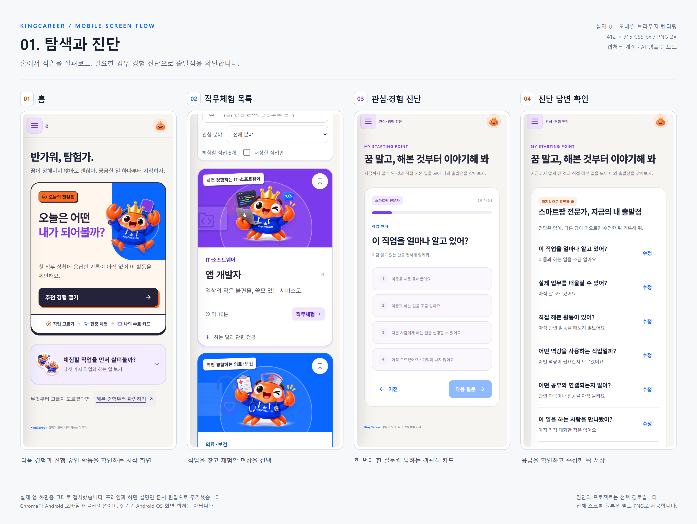
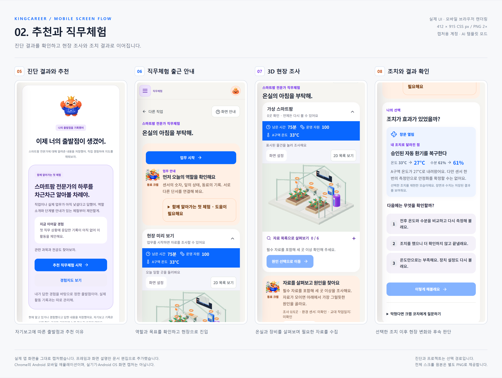
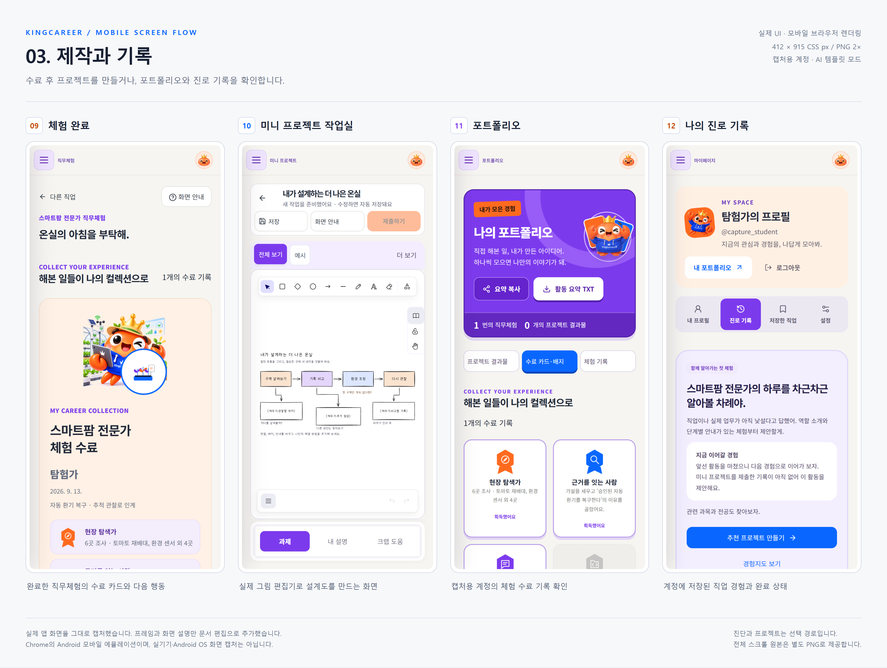

# KingCareer 모바일 화면 흐름

동일한 화면의 데스크톱 버전은 [웹 화면 문서](web-wireframes.md)에서 비교할 수 있습니다.

실제 앱을 모바일 화면으로 렌더링한 캡처입니다. 와이어프레임처럼 화면별 번호·설명·대표 흐름을 덧붙였으며, 캡처 내부의 UI와 문구를 재작성하거나 생성형 이미지로 대체하지 않았습니다.

## 문서용 보드

- [캡처 묶음 ZIP 다운로드](images/mobile-capture-v1.zip)
- [전체 화면 모음 PNG](images/mobile-capture-v1/mobile-flow-overview.png)
- [브라우저로 보는 화면 흐름 HTML](images/mobile-capture-v1/mobile-wireframes.html)
- [캡처 목록·환경 정보 JSON](images/mobile-capture-v1/manifest.json)

### 1. 탐색과 진단

홈 → 직업 목록 → 선택적인 관심·경험 진단 → 답변 확인.



### 2. 추천과 직무체험

출발점·추천 이유 → 출근 안내 → 현장 조사 → 조치 결과 확인.



### 3. 제작과 기록

체험 완료 후 수료 카드를 확인합니다. 미니 프로젝트는 선택적으로 진행하며 포트폴리오와 진로 기록에서 저장한 활동을 확인합니다. 일렬로 반드시 거쳐야 하는 단계는 아닙니다.



## 개별 화면

| 번호 | 화면 | 모바일 한 화면 | 전체 스크롤 |
| --- | --- | --- | --- |
| 01 | 홈 | [PNG](images/mobile-capture-v1/01-home.png) | [전체](images/mobile-capture-v1/01-home-full.png) |
| 02 | 직무체험 목록 | [PNG](images/mobile-capture-v1/02-careers.png) | [전체](images/mobile-capture-v1/02-careers-full.png) |
| 03 | 객관식 진단 | [PNG](images/mobile-capture-v1/03-diagnosis.png) | [전체](images/mobile-capture-v1/03-diagnosis-full.png) |
| 04 | 진단 답변 확인 | [PNG](images/mobile-capture-v1/04-review-answers.png) | [전체](images/mobile-capture-v1/04-review-answers-full.png) |
| 05 | 출발점과 추천 | [PNG](images/mobile-capture-v1/05-starting-point.png) | [전체](images/mobile-capture-v1/05-starting-point-full.png) |
| 06 | 직무체험 안내 | [PNG](images/mobile-capture-v1/06-simulation-brief.png) | [전체](images/mobile-capture-v1/06-simulation-brief-full.png) |
| 07 | 3D 현장 조사 | [PNG](images/mobile-capture-v1/07-simulation-scene.png) | [전체](images/mobile-capture-v1/07-simulation-scene-full.png) |
| 08 | 조치 결과 확인 | [PNG](images/mobile-capture-v1/08-action-result.png) | [전체](images/mobile-capture-v1/08-action-result-full.png) |
| 09 | 수료 카드 | [PNG](images/mobile-capture-v1/09-certificate.png) | [전체](images/mobile-capture-v1/09-certificate-full.png) |
| 10 | 프로젝트 작업실 | [PNG](images/mobile-capture-v1/10-project.png) | [전체](images/mobile-capture-v1/10-project-full.png) |
| 11 | 포트폴리오 | [PNG](images/mobile-capture-v1/11-portfolio.png) | [전체](images/mobile-capture-v1/11-portfolio-full.png) |
| 12 | 나의 진로 기록 | [PNG](images/mobile-capture-v1/12-records.png) | [전체](images/mobile-capture-v1/12-records-full.png) |

## 캡처 조건

- 캡처일: 2026-09-13.
- 브라우저: 설치된 Chrome, Playwright의 Pixel 7 모바일 에뮬레이션.
- 뷰포트: 412 × 915 CSS px, 배율 2×. 개별 PNG는 824 × 1830 px.
- Android 실기기나 Android OS의 스크린샷은 아닙니다. 앱의 반응형 화면을 실제 브라우저에서 캡처했습니다.
- 로컬 Vite의 실제 프론트엔드와 별도로 실행한 실제 FastAPI를 연결했습니다. API 응답 목업을 사용하지 않았습니다.
- 별도 SQLite·캡처용 계정 ‘탐험가’를 사용했습니다. 기존 사용자 기록을 수정하지 않았습니다.
- 진단은 화면에서 입력했습니다. 수료 기록은 캡처 준비용으로 실제 체험 API의 조사·비교·조치·확인·인계·완료 절차를 진행해 생성했습니다. 실제 학생의 성취 기록은 아닙니다.
- AI는 template 모드로 실행했으며 외부 모델 호출은 하지 않았습니다.
- 프로젝트 화면은 기본 그림 가이드가 있는 초안입니다. 포트폴리오에는 캡처용 체험 수료 기록이 있으며 프로젝트 제출·AI 평가 완료를 연출하지 않았습니다.
- 화면 안내 팝업을 닫고, 현장과 조치 화면은 필요한 위치까지 스크롤했습니다. 그림 편집기는 실제 ‘그림 전체 보기’ 기능을 사용했습니다.
- 모션 줄이기를 적용해 캡처 시점을 안정화했습니다. 캡처 작업은 기능 테스트 통과 보고가 아닙니다.

## 재생성

로컬 프론트엔드가 5173번 포트에서 실행 중이고 Python 가상환경 및 Chrome이 설치되어 있어야 합니다. 캡처 스크립트는 8105번 포트에 별도 백엔드를 시작하고 작업 후 종료합니다.

```powershell
node scripts/capture-mobile-docs.mjs
node scripts/assemble-mobile-docs.mjs
```

캡처용 DB는 Git에서 제외된 `.local/mobile-docs-*`에 보관됩니다. 스크립트를 다시 실행하면 이 문서의 v1 이미지가 갱신됩니다. 과거 버전을 유지하려면 먼저 별도 버전 폴더로 복사하세요.
