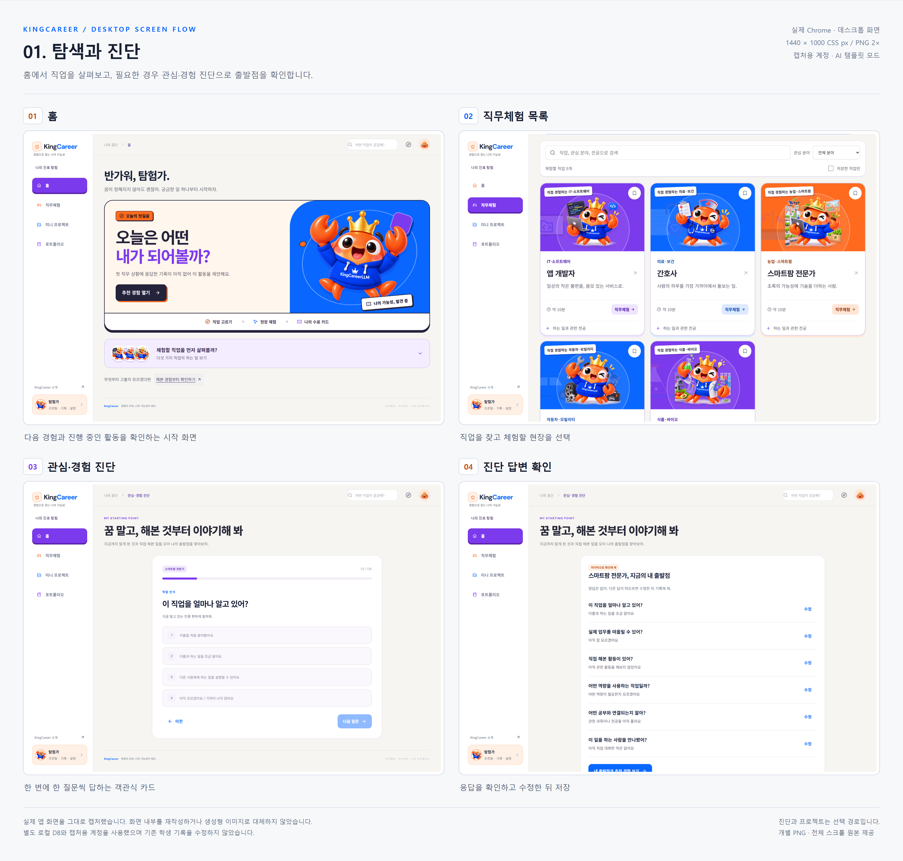
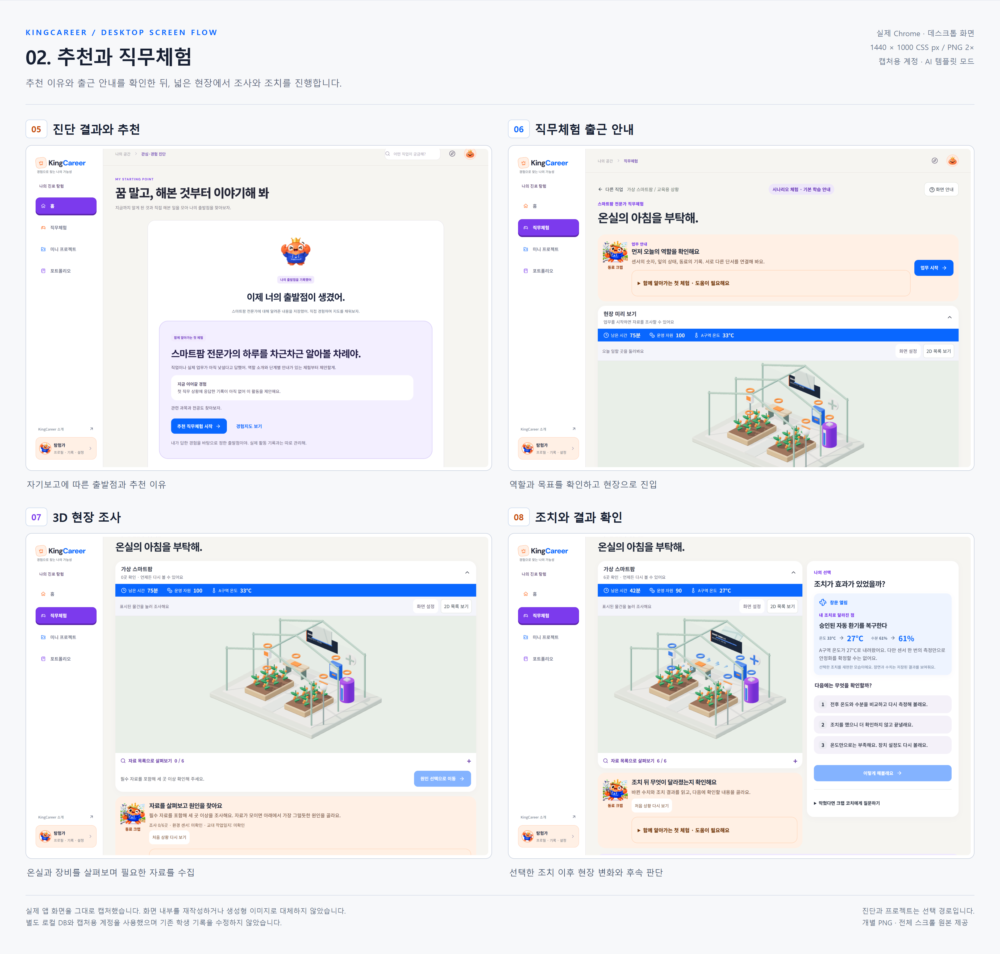
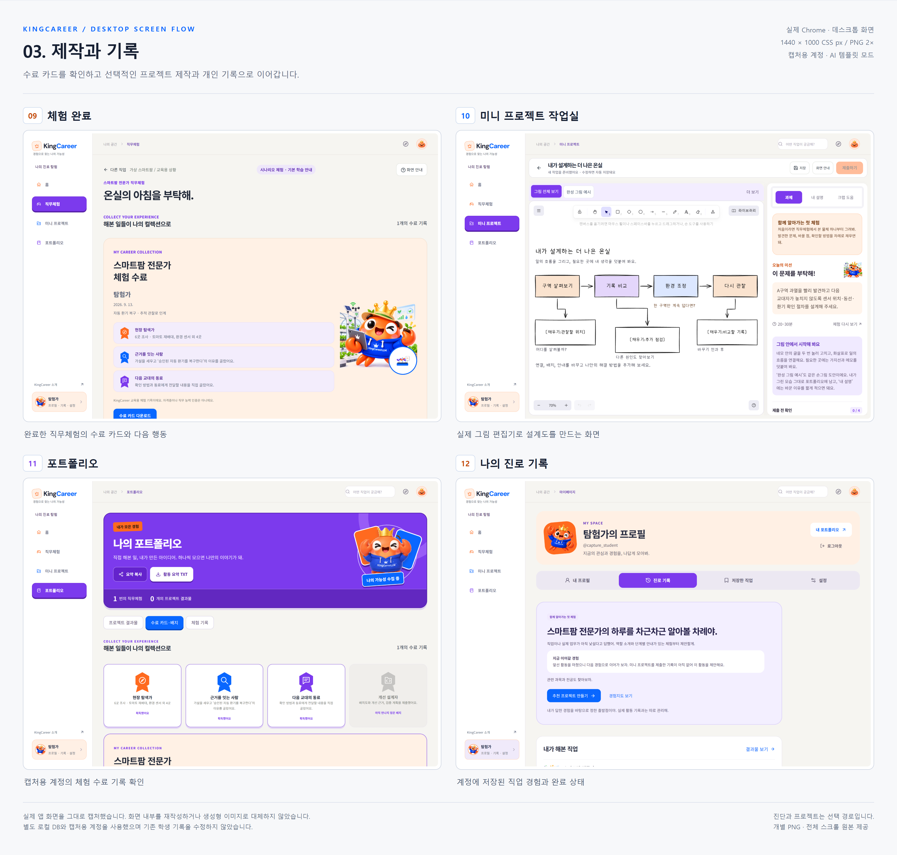

# KingCareer 웹 화면 흐름

실제 앱을 데스크톱 Chrome에서 캡처한 문서입니다. [모바일 화면 문서](mobile-wireframes.md)와 같은 12개 화면을 같은 순서로 배치해 비교할 수 있습니다. 캡처 내부의 UI와 문구는 수정하지 않았으며, 문서용 번호·제목·설명만 추가했습니다.

## 문서용 보드

- [전체 화면 모음 PNG](images/web-capture-v1/web-flow-overview.png)
- [확대해서 보는 HTML](images/web-capture-v1/web-wireframes.html) — 화면을 누르면 개별 원본이 열립니다.
- [캡처 목록·환경 정보](images/web-capture-v1/manifest.json)

### 1. 탐색과 진단

홈 → 직무체험 목록 → 선택적인 관심·경험 진단 → 답변 확인.



### 2. 추천과 직무체험

출발점과 추천 이유 → 출근 안내 → 3D 현장 조사 → 조치 결과 확인. 넓은 화면에서는 현장과 선택·결과 영역을 함께 볼 수 있습니다.



### 3. 제작과 기록

체험 수료 카드를 확인한 뒤 프로젝트를 만들거나 개인 기록을 확인합니다. 미니 프로젝트는 선택 경로이며 모든 화면을 순서대로 거쳐야 하는 것은 아닙니다.



## 개별 원본

| 번호 | 화면 | 데스크톱 한 화면 | 전체 스크롤 |
| --- | --- | --- | --- |
| 01 | 홈 | [PNG](images/web-capture-v1/01-home.png) | [전체](images/web-capture-v1/01-home-full.png) |
| 02 | 직무체험 목록 | [PNG](images/web-capture-v1/02-careers.png) | [전체](images/web-capture-v1/02-careers-full.png) |
| 03 | 객관식 진단 | [PNG](images/web-capture-v1/03-diagnosis.png) | [전체](images/web-capture-v1/03-diagnosis-full.png) |
| 04 | 진단 답변 확인 | [PNG](images/web-capture-v1/04-review-answers.png) | [전체](images/web-capture-v1/04-review-answers-full.png) |
| 05 | 출발점과 추천 | [PNG](images/web-capture-v1/05-starting-point.png) | [전체](images/web-capture-v1/05-starting-point-full.png) |
| 06 | 직무체험 안내 | [PNG](images/web-capture-v1/06-simulation-brief.png) | [전체](images/web-capture-v1/06-simulation-brief-full.png) |
| 07 | 3D 현장 조사 | [PNG](images/web-capture-v1/07-simulation-scene.png) | [전체](images/web-capture-v1/07-simulation-scene-full.png) |
| 08 | 조치 결과 확인 | [PNG](images/web-capture-v1/08-action-result.png) | [전체](images/web-capture-v1/08-action-result-full.png) |
| 09 | 수료 카드 | [PNG](images/web-capture-v1/09-certificate.png) | [전체](images/web-capture-v1/09-certificate-full.png) |
| 10 | 프로젝트 작업실 | [PNG](images/web-capture-v1/10-project.png) | [전체](images/web-capture-v1/10-project-full.png) |
| 11 | 포트폴리오 | [PNG](images/web-capture-v1/11-portfolio.png) | [전체](images/web-capture-v1/11-portfolio-full.png) |
| 12 | 나의 진로 기록 | [PNG](images/web-capture-v1/12-records.png) | [전체](images/web-capture-v1/12-records-full.png) |

## 캡처 조건

- 캡처일: 2026-09-13.
- 브라우저: 설치된 Chrome의 데스크톱 모드. 뷰포트 1440 × 1000 CSS px, 배율 2×. 개별 PNG는 2880 × 2000 px입니다.
- 로컬 Vite의 실제 UI와 별도로 실행한 FastAPI·SQLite를 사용했습니다. API 응답을 가짜 데이터로 대체하지 않았습니다.
- 기존 학생 기록과 분리한 캡처 전용 계정 ‘탐험가’를 사용했습니다. 수료 기록은 실제 API의 조사·비교·조치·확인·인계·완료 절차로 생성한 문서용 기록입니다.
- 진단 응답은 화면에서 입력했습니다. 프로젝트는 기본 그림 가이드가 있는 초안이며, 프로젝트 제출 완료를 연출하지 않았습니다. 포트폴리오에는 캡처용 체험 수료 기록이 표시됩니다.
- AI는 template 모드로 실행했고 외부 모델을 호출하지 않았습니다.
- 화면 안내 팝업을 닫고, 현장·조치 화면은 작업 공간이 잘 보이는 위치로 스크롤했습니다. 편집기는 실제 ‘그림 전체 보기’를 사용했습니다.
- 캡처 시 모션 줄이기를 적용했습니다. 생성형 이미지가 아니며, 이 작업을 전체 기능 테스트 통과로 보고하지 않습니다.

## 재생성

프론트엔드가 5173번 포트에서 실행 중이고 Python 가상환경과 Chrome이 설치되어 있어야 합니다. 8105번 포트는 캡처 전용 백엔드가 사용하며 작업 후 종료합니다. 모바일 캡처와 동시에 실행하지 않습니다.

```powershell
node scripts/capture-web-docs.mjs
node scripts/assemble-web-docs.mjs
```

캡처 로직은 모바일과 공유합니다. 웹용 옵션만 별도로 적용하며 기존 모바일 이미지는 덮어쓰지 않습니다. 캡처용 DB는 Git에서 제외된 `.local/web-docs-*`에 보관합니다. 재실행 시 웹 v1 이미지는 갱신됩니다.
